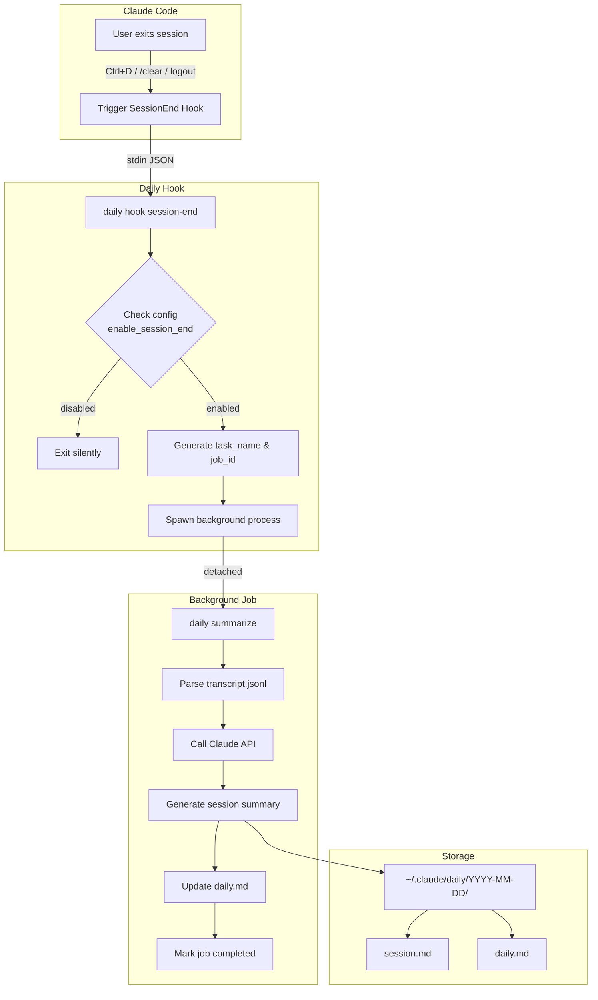
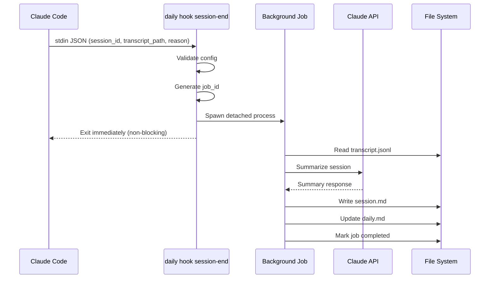

# Daily


A context archive system for [Claude Code](https://claude.ai/code) that automatically records and summarizes your daily AI-assisted work sessions.

## How It Works



### Workflow Steps

1. **Session Start** - Hook creates daily folder structure (`~/.claude/daily/YYYY-MM-DD/`)
2. **Session End** - Hook triggers background archival process (non-blocking)
3. **Summarization** - Background job processes transcript via Claude API
4. **Aggregation** - Updates daily summary with insights from all sessions

## Hooks Architecture

Daily integrates with Claude Code through the [Hooks System](https://docs.anthropic.com/en/docs/claude-code/hooks).

### SessionEnd Hook Flow



### Hook Input Schema

When Claude Code triggers the SessionEnd hook, it passes JSON via stdin:

```json
{
  "session_id": "abc123",
  "transcript_path": "/Users/you/.claude/projects/.../session.jsonl",
  "cwd": "/your/project/path",
  "hook_event_name": "SessionEnd",
  "reason": "prompt_input_exit"
}
```

### Session End Reasons

| Reason | Trigger | Archived |
|--------|---------|:--------:|
| `prompt_input_exit` | User presses Ctrl+D | ✅ |
| `logout` | User logs out | ✅ |
| `clear` | User runs /clear command | ✅ |
| `other` | Other exit methods | ✅ |

All exit reasons trigger archival to ensure complete session history.

### Job Management

Background jobs can be monitored and managed:

```bash
# List running/recent jobs
daily jobs list

# List all jobs (including completed)
daily jobs list --all

# View job logs
daily jobs log <job_id>

# Follow job logs in real-time
daily jobs log <job_id> --follow

# Kill a running job
daily jobs kill <job_id>

# Cleanup old jobs (default: 7 days)
daily jobs cleanup
```

### Job Storage

```
~/.claude/daily/jobs/
├── 20240115-143052-myproject-a1b2c3.json   # Job metadata
├── 20240115-143052-myproject-a1b2c3.log    # Job output log
└── ...
```

## Features

- **Automatic Recording** - Hooks into Claude Code to capture session transcripts
- **Smart Summarization** - Background AI processing generates meaningful summaries
- **Daily Insights** - Aggregates all sessions into actionable daily summary
- **Skill Extraction** - Extract reusable skills and commands from sessions
- **Terminal Viewer** - View archives directly in terminal with beautiful formatting

## Quick Start

```bash
# 1. Install from source
git clone https://github.com/yourusername/daily.git
cd daily && cargo install --path .

# 2. Initialize and install hooks
daily init
daily install

# 3. View today's archive
daily view
```

## Commands

| Command                                  | Description                                    |
| ---------------------------------------- | ---------------------------------------------- |
| `daily init`                             | Initialize system and create storage directory |
| `daily install`                          | Install Claude Code hooks and slash commands   |
| `daily view`                             | View today's archive                           |
| `daily view --date 2024-01-15`           | View archive for specific date                 |
| `daily view --list`                      | List all sessions                              |
| `daily view --summary-only`              | Show daily summary only                        |
| `daily config --show`                    | Show current configuration                     |
| `daily config --set-storage ~/path`      | Change storage location                        |
| `daily extract-skill --session "name"`   | Extract reusable skill from session            |
| `daily extract-command --session "name"` | Extract reusable command from session          |

### Claude Code Slash Commands

After `daily install`:

| Command              | Description                           |
| -------------------- | ------------------------------------- |
| `/daily-view`        | View daily archive                    |
| `/daily-get-skill`   | Extract skill from session insights   |
| `/daily-get-command` | Extract command from session insights |

## Configuration

Config file: `~/.config/daily/daily.toml`

```toml
storage_path = "~/.claude/daily"
```

## Archive Structure

```
~/.claude/daily/
├── 2024-01-15/
│   ├── daily.md           # Daily summary
│   ├── fix-bug.md         # Session archive
│   └── new-feature.md     # Session archive
└── 2024-01-16/
    ├── daily.md
    └── refactor.md
```

## Requirements

- Rust 1.70+
- Claude Code CLI

## Contributing

1. Fork the repository
2. Create feature branch (`git checkout -b feature/amazing-feature`)
3. Commit changes (`git commit -m 'Add amazing feature'`)
4. Push to branch (`git push origin feature/amazing-feature`)
5. Open a Pull Request

## License

MIT License - see [LICENSE](LICENSE) for details.
