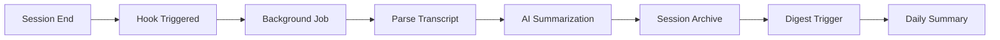

# Daily


English | [中文](README.zh-CN.md)

A context archive system for [Claude Code](https://claude.ai/code) that automatically records and summarizes your AI-assisted work sessions.

## Features

- **Automatic Recording** - Hooks into Claude Code to capture session transcripts
- **Smart Summarization** - Background AI processing generates meaningful summaries
- **Daily Insights** - Aggregates all sessions into actionable daily summary
- **Skill Extraction** - Extract reusable skills and commands from sessions

## Installation

### One-line Install (Recommended)

```bash
curl -fsSL https://raw.githubusercontent.com/oanakiaja/claude-daily/main/scripts/install.sh | bash
```

### Build from Source

```bash
git clone https://github.com/oanakiaja/claude-daily.git
cd claude-daily
cargo install --path .
```

## Quick Start

```bash
# 1. Initialize Daily
daily init

# 2. Install Claude Code hooks
daily install

# 3. View today's archive
daily view
```

## How It Works



1. **Session End** - Claude Code triggers SessionEnd hook
2. **Background Job** - Non-blocking process spawned for summarization
3. **AI Summarization** - Claude API processes transcript
4. **Session Archive** - Individual session saved to `~/.claude/daily/{date}/{task}.md`
5. **Digest** - Sessions are consolidated into `daily.md` via manual `daily digest` or auto-trigger

## Commands

| Command | Description |
|---------|-------------|
| `daily init` | Initialize system and create storage directory |
| `daily init -i` | Interactive setup with directory selection and digest config |
| `daily install` | Install Claude Code hooks and slash commands |
| `daily view` | View today's archive (interactive date selection) |
| `daily view --date 2024-01-15` | View archive for specific date |
| `daily view --list` | List all sessions for the day |
| `daily today` | Quick alias for today's archive |
| `daily yest` | Quick alias for yesterday's archive |
| `daily digest` | Consolidate today's sessions into daily.md |
| `daily digest --date 2024-01-15` | Digest sessions for specific date |
| `daily config --show` | Show current configuration |
| `daily extract-skill` | Extract reusable skill from session |
| `daily extract-command` | Extract reusable command from session |
| `daily jobs list` | List background jobs |
| `daily jobs log <id>` | View job logs |

### Claude Code Slash Commands

After `daily install`, these commands are available in Claude Code:

| Command | Description |
|---------|-------------|
| `/daily-view` | View daily archive |
| `/daily-get-skill` | Extract skill from session insights |
| `/daily-get-command` | Extract command from session insights |

## Configuration

View current config with `daily config --show`.

Config file location (macOS): `~/Library/Application Support/rs.daily/config.toml`

Key settings:
- `storage.path` - Archive storage location (default: `~/.claude/daily`)
- `summarization.model` - AI model for summarization (default: `sonnet`)
- `summarization.digest_time` - Auto-digest trigger time (default: `06:00`)
- `summarization.auto_digest_enabled` - Enable/disable auto-digest (default: `true`)
- `hooks.enable_session_end` - Enable/disable auto-archiving

### Digest System

Sessions are archived individually as `{task-name}.md` files. The digest process consolidates all sessions into a single `daily.md`:

- **Manual digest**: Run `daily digest` to consolidate today's sessions
- **Auto-digest**: On each session start, if current time >= `digest_time` and yesterday has un-digested sessions, they will be automatically digested

After digest, individual session files are removed, keeping only the consolidated `daily.md`.

## Archive Structure

```
~/.claude/daily/
├── 2024-01-15/              # After digest (sessions consolidated)
│   └── daily.md             # Daily summary with all sessions
├── 2024-01-16/              # Before digest (sessions pending)
│   ├── daily.md             # Placeholder
│   ├── fix-bug-143052.md    # Session archive
│   └── new-feature-152310.md # Session archive
└── jobs/
    └── *.json, *.log        # Background job tracking
```

Note: After running `daily digest`, individual session files are removed and consolidated into `daily.md`.

## Requirements

- Rust 1.70+ (for building)
- Claude Code CLI

## Contributing

1. Fork the repository
2. Create feature branch (`git checkout -b feature/amazing-feature`)
3. Commit changes (`git commit -m 'Add amazing feature'`)
4. Push to branch (`git push origin feature/amazing-feature`)
5. Open a Pull Request

## License

MIT License - see [LICENSE](LICENSE) for details.
