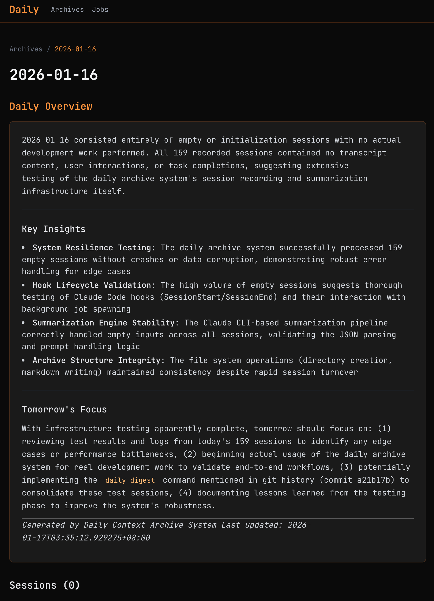

# Daily


English | [中文](README.zh-CN.md)


> <i> Every Claude code chat makes you better. </i>

**More than a log — a system that compounds your context.**

Daily is a context archive system for [Claude Code](https://claude.ai/code) that automatically records, summarizes, and distills reusable skills from your AI-assisted work sessions. The more you use it, the stronger your personal context library becomes.



## Why Daily?

Every session holds valuable insights — problem-solving patterns, workflow optimizations, and domain knowledge. But these insights fade. Daily captures them automatically and transforms them into **reusable skills and commands** that compound over time.

> **Compound Context**: Like compound interest for your expertise. Each session adds to your personal knowledge base, making future sessions more powerful — whether you're coding, writing, researching, or learning.

## Features

- **Automatic Recording** - Hooks into Claude Code to capture session transcripts
- **Smart Summarization** - Background AI processing generates meaningful summaries
- **Daily Insights** - Aggregates all sessions into actionable daily summary
- **Skill Extraction** - Distill reusable skills and commands from your sessions — your context library compounds over time

## Installation

### One-line Install (Recommended)

```bash
curl -fsSL https://raw.githubusercontent.com/oanakiaja/claude-daily/main/scripts/install.sh | bash
```

### Build from Source

```bash
git clone https://github.com/oanakiaja/claude-daily.git
cd claude-daily
cargo install --path .
```

## Quick Start

```bash
# 1. Initialize Daily
daily init

# 2. Install Claude Code hooks
daily install

# 3. View today's archive
daily show
```

## How It Works

1. **Session End** - Claude Code triggers SessionEnd hook
2. **Background Job** - Non-blocking process spawned for summarization
3. **AI Summarization** - Claude API processes transcript
4. **Session Archive** - Individual session saved to `~/.claude/daily/{date}/{task}.md`
5. **Skill Sedimentation** - Auto-evaluates if session contains extractable knowledge
6. **Digest** - Sessions are consolidated into `daily.md` via manual `daily digest` or auto-trigger

## Skill Sedimentation (Auto-Learning)

Daily automatically identifies and extracts reusable knowledge from your sessions. When a session ends, it evaluates whether the work contains skills worth preserving using the **"Three Questions" quality gate**:

1. **Did you hit a wall?**  - Was there debugging, trial-and-error, or non-obvious discovery?
2. **Will it happen again?** - Is this a recurring problem, not a one-time edge case?
3. **Can you explain it?** - Can the solution be clearly described and verified?

### How It Works

```
SessionEnd → Summarize → Quality Gate → Pending Skills → SessionStart Reminder
```

1. When your session ends, Daily analyzes if there's extractable knowledge
2. Skills that pass the quality gate are saved to `~/.claude/daily/pending-skills/`
3. On your next session start, you'll see a reminder:

```
[daily] ━━━━━━━━━━━━━━━━━━━━━━━━━━━━━━━━━━━━━━━━━━━━━━━━━━
[daily] 2 pending skill(s) waiting for review:
[daily]   • 2024-01-18/fix-econnrefused
[daily]   • 2024-01-17/next-build-optimization
[daily]
[daily] Review with: daily review-skills
[daily] Or ask Claude: "review my pending skills"
[daily] ━━━━━━━━━━━━━━━━━━━━━━━━━━━━━━━━━━━━━━━━━━━━━━━━━━
```

### Managing Pending Skills

```bash
# List all pending skills
daily review-skills

# Install a skill to ~/.claude/skills/ (Claude will auto-use it)
daily review-skills --install 2024-01-18/fix-econnrefused

# Delete a skill you don't need
daily review-skills --delete 2024-01-18/fix-econnrefused
```

Once installed, skills are placed in `~/.claude/skills/{skill-name}/SKILL.md` where Claude Code automatically discovers and applies them when relevant conditions are detected.

## Commands

| Command                          | Description                                                     |
| -------------------------------- | --------------------------------------------------------------- |
| `daily init`                     | Initialize system and create storage directory                  |
| `daily init -i`                  | Interactive setup with directory selection and digest config    |
| `daily install`                  | Install Claude Code hooks and slash commands                    |
| `daily show`                     | Open web dashboard in browser (default: http://127.0.0.1:31456) |
| `daily show --port 8080`         | Start dashboard on custom port                                  |
| `daily show --no-open`           | Start server without opening browser                            |
| `daily view`                     | View today's archive (interactive date selection)               |
| `daily view --date 2024-01-15`   | View archive for specific date                                  |
| `daily view --list`              | List all sessions for the day                                   |
| `daily today`                    | Quick alias for today's archive                                 |
| `daily yest`                     | Quick alias for yesterday's archive                             |
| `daily digest`                   | Consolidate today's sessions into daily.md                      |
| `daily digest --date 2024-01-15` | Digest sessions for specific date                               |
| `daily config --show`            | Show current configuration                                      |
| `daily extract-skill`            | Extract reusable skill from session                             |
| `daily extract-command`          | Extract reusable command from session                           |
| `daily review-skills`            | List pending skills waiting for review                          |
| `daily review-skills --install`  | Install a pending skill to ~/.claude/skills/                    |
| `daily review-skills --delete`   | Delete a pending skill                                          |
| `daily jobs list`                | List background jobs                                            |
| `daily jobs log <id>`            | View job logs                                                   |

### Claude Code Slash Commands

After `daily install`, these commands are available in Claude Code:

| Command              | Description                           |
| -------------------- | ------------------------------------- |
| `/daily-view`        | View daily archive                    |
| `/daily-get-skill`   | Extract skill from session insights   |
| `/daily-get-command` | Extract command from session insights |

## Configuration

View current config with `daily config --show`.

Config file location (macOS): `~/Library/Application Support/rs.daily/config.toml`

Key settings:

- `storage.path` - Archive storage location (default: `~/.claude/daily`)
- `summarization.model` - AI model for summarization (default: `sonnet`)
- `summarization.digest_time` - Auto-digest trigger time (default: `06:00`)
- `summarization.auto_digest_enabled` - Enable/disable auto-digest (default: `true`)
- `hooks.enable_session_end` - Enable/disable auto-archiving

### Digest System

Sessions are archived individually as `{task-name}.md` files. The digest process consolidates all sessions into a single `daily.md`:

- **Manual digest**: Run `daily digest` to consolidate today's sessions
- **Auto-digest**: On each session start, if current time >= `digest_time` and yesterday has un-digested sessions, they will be automatically digested

After digest, individual session files are removed, keeping only the consolidated `daily.md`.

## Archive Structure

```
~/.claude/daily/
├── 2024-01-15/              # After digest (sessions consolidated)
│   └── daily.md             # Daily summary with all sessions
├── 2024-01-16/              # Before digest (sessions pending)
│   ├── daily.md             # Placeholder
│   ├── fix-bug-143052.md    # Session archive
│   └── new-feature-152310.md # Session archive
├── pending-skills/          # Auto-extracted skills awaiting review
│   └── 2024-01-16/
│       └── fix-econnrefused.md
└── jobs/
    └── *.json, *.log        # Background job tracking
```

Note: After running `daily digest`, individual session files are removed and consolidated into `daily.md`.

## Requirements

- Rust 1.70+ (for building)
- Claude Code CLI

## License

MIT License - see [LICENSE](LICENSE) for details.
